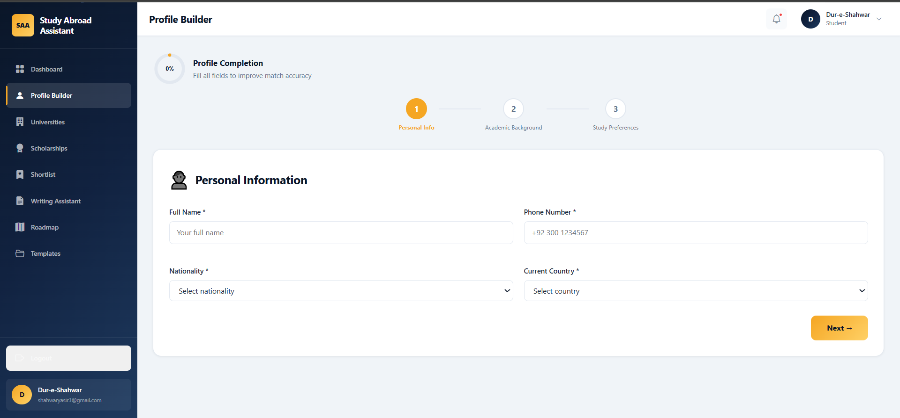
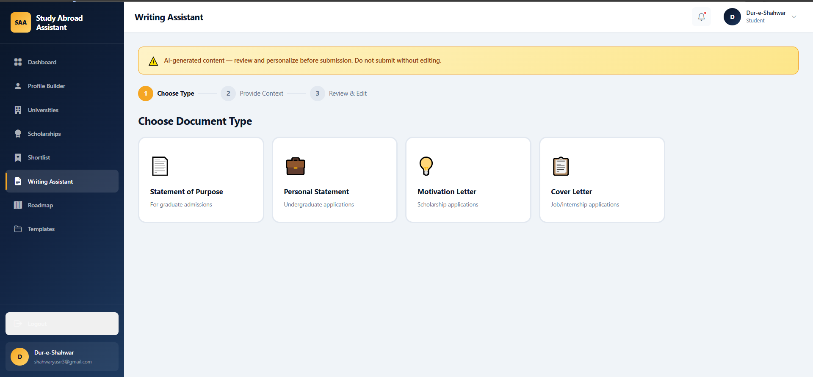
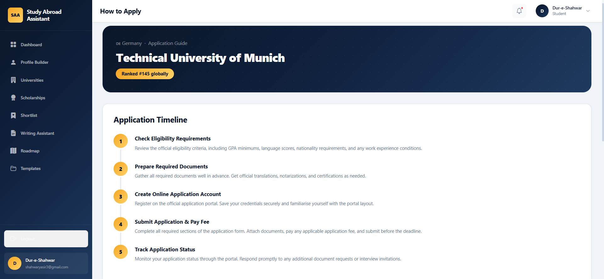
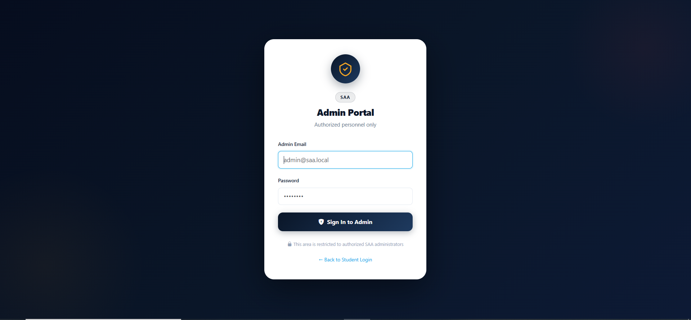
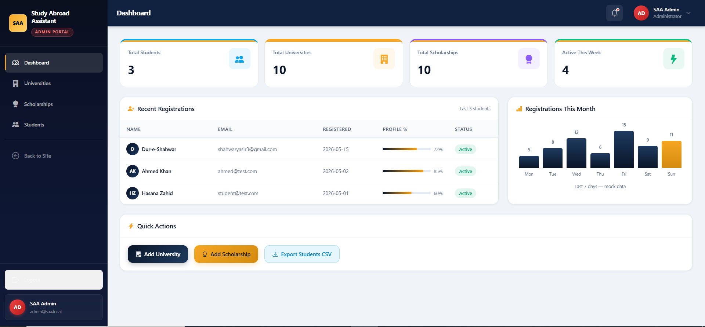
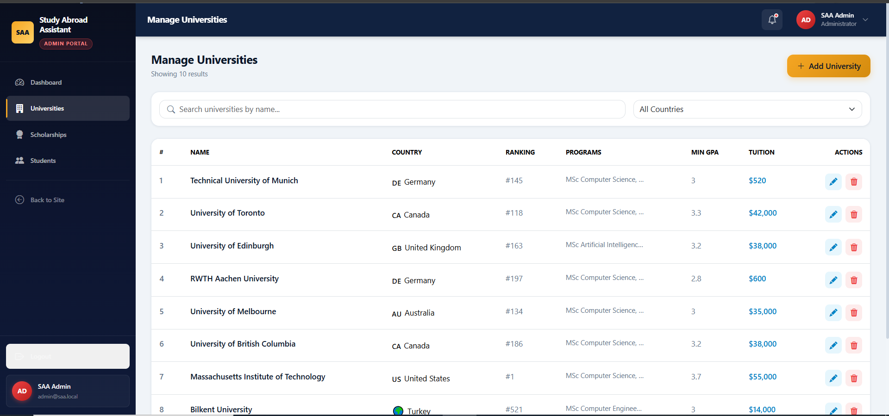
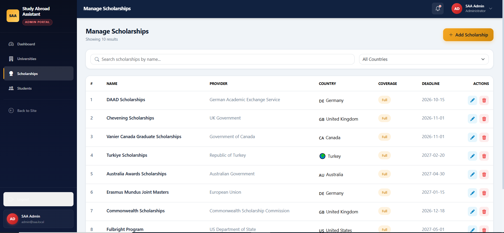
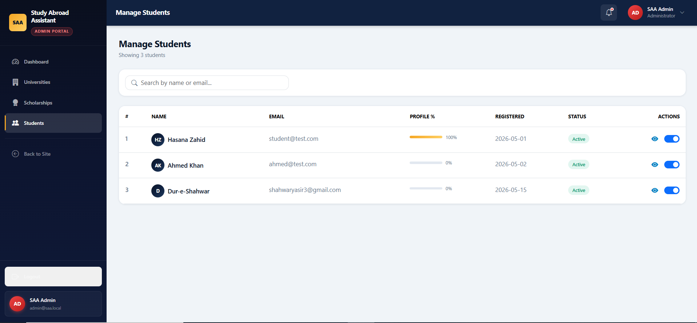

# 🎓 SAA Frontend
> "React frontend for Study Abroad Assistant — built by Dur-e-Shahwar"


## Overview
This is the frontend application for the Study Abroad Assistant, a platform designed to help students discover and apply to international universities and scholarships. It currently runs fully on mock data independently of the backend, allowing for complete UI/UX validation and feature demonstration. Built exclusively by Dur-e-Shahwar, the interface features a premium design system with dynamic micro-animations and a responsive layout.

## Screenshots

> 📸 Screenshots captured from the live mock frontend

### 🏠 Public Pages
| Page | Preview |
|------|---------|
| Homepage Hero |  |
| Login Page |  |
| Register Page |  |

### 📊 Student Pages
| Page | Preview |
|------|---------|
| Dashboard |  |
| Profile Builder |  |
| Universities |  |
| Scholarships |  |
| Shortlist |  |
| Writing Assistant |  |
| Roadmap |  |
| Templates |  |
| How To Apply |  |

### 🔐 Admin Pages
| Page | Preview |
|------|---------|
| Admin Login |  |
| Admin Dashboard |  |
| Manage Universities |  |
| Manage Scholarships |  |
| Manage Students |  |

> **Note on screenshots:**
> To add screenshots: run `npm run dev`, screenshot each page, save to `frontend/docs/screenshots/` with the filenames above, then push to frontend/person1 branch.

## Pages

### Public Pages
| Page | Route | Description |
|------|-------|-------------|
| HomePage | `/` | Hero, features, countries, testimonials, CTA |
| LoginPage | `/login` | Split layout, form validation, mock auth |
| RegisterPage | `/register` | Split layout, password strength indicator |

### Student Pages (JWT Protected)
| Page | Route | Description |
|------|-------|-------------|
| DashboardPage | `/dashboard` | Welcome banner, stat cards, quick actions, activity feed |
| ProfileBuilderPage | `/profile` | 3-step form wizard, live completion ring |
| UniversitiesPage | `/universities` | Filter sidebar, cards with country images, match score |
| ScholarshipsPage | `/scholarships` | Gradient cards, coverage badges, deadline countdown |
| ShortlistPage | `/shortlist` | Tabbed list, status dropdown, remove items |
| HowToApplyPage | `/how-to-apply/:type/:id` | Timeline steps, docs checklist, tips |
| WritingAssistantPage | `/writing-assistant` | 3-step wizard, AI disclaimer, copy/download |
| TemplatesPage | `/templates` | Filter tabs, preview modal, download buttons |
| RoadmapPage | `/roadmap` | SVG progress ring, milestone timeline, status tracking |

### Admin Pages (Admin JWT Protected)
| Page | Route | Description |
|------|-------|-------------|
| AdminLoginPage | `/admin/login` | Dark navy theme, shield icon |
| AdminDashboardPage | `/admin` | Stat cards, registrations table, bar chart |
| ManageUniversitiesPage | `/admin/universities` | Table, add/edit/delete modal, mock CRUD |
| ManageScholarshipsPage | `/admin/scholarships` | Table, coverage badges, modal CRUD |
| ManageStudentsPage | `/admin/students` | Profile % bar, activate/deactivate toggle |

## Design System

### Colors
| Token | Value | Usage |
|-------|-------|-------|
| Navy | `#0A1628` | Primary, sidebar, hero |
| Gold | `#F5A623` | Accent, CTAs, active states |
| Teal | `#0EA5E9` | Secondary accent, info |
| Background | `#F0F4F8` | Page background |
| Success | `#10B981` | Completed states |
| Danger | `#EF4444` | Errors, deadlines |

### Typography
- **Headings:** Clash Display (Google Fonts)
- **Body:** Satoshi (Google Fonts)
- **Base size:** 15px

### Key UI Patterns
- Glassmorphism on hero sections
- hover-lift cards (translateY -5px on hover)
- Gradient text on key headings
- Skeleton shimmer loading states
- fadeInUp animations with staggered delays
- SVG circular progress rings
- Animated number counters

## Project Structure

```text
frontend/
├── docs/                # Frontend-specific documentation
│   └── screenshots/     # Page preview screenshots
├── public/              # Static assets
├── src/                 # Application source code
│   ├── assets/          # CSS, images, and visual resources
│   ├── components/      # Reusable React UI components
│   ├── pages/           # Core page views per route
│   ├── services/        # Mock data APIs and storage helpers
│   ├── App.jsx          # Main application router and state
│   └── main.jsx         # React application entry point
├── package.json         # Project dependencies and scripts
└── vite.config.js       # Vite build configuration
```
